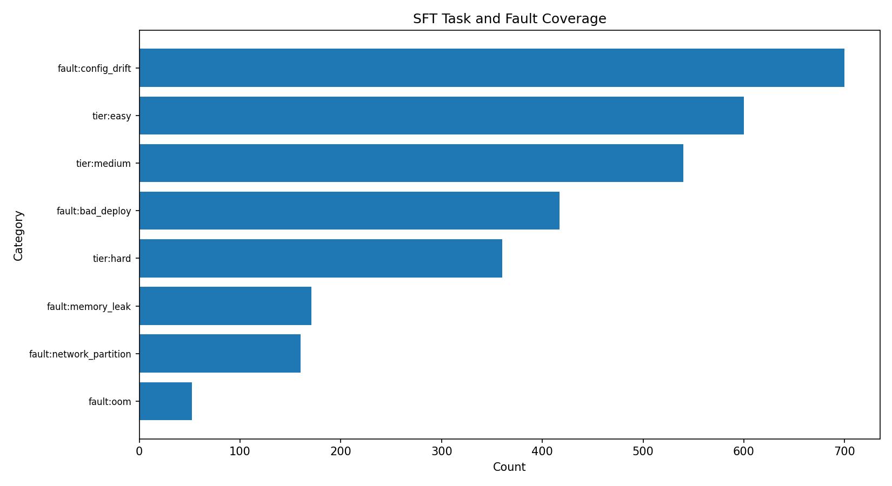
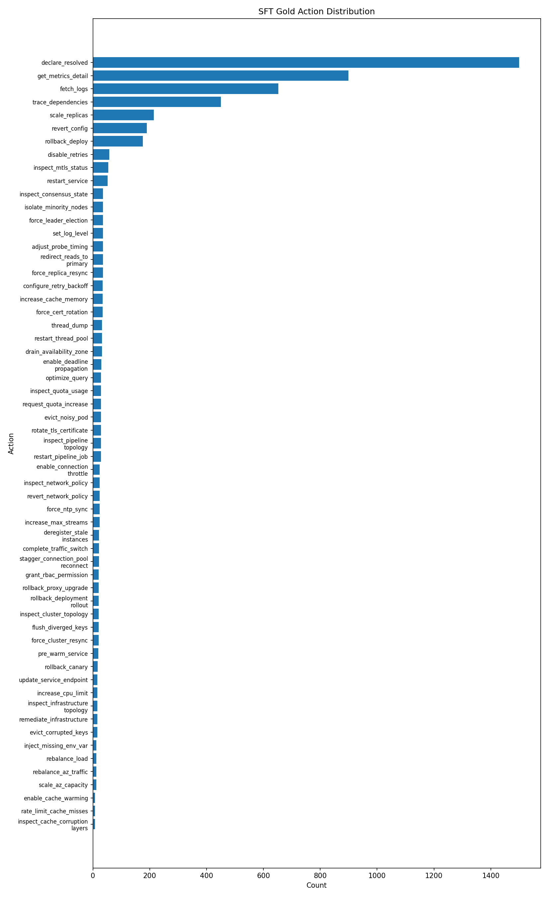
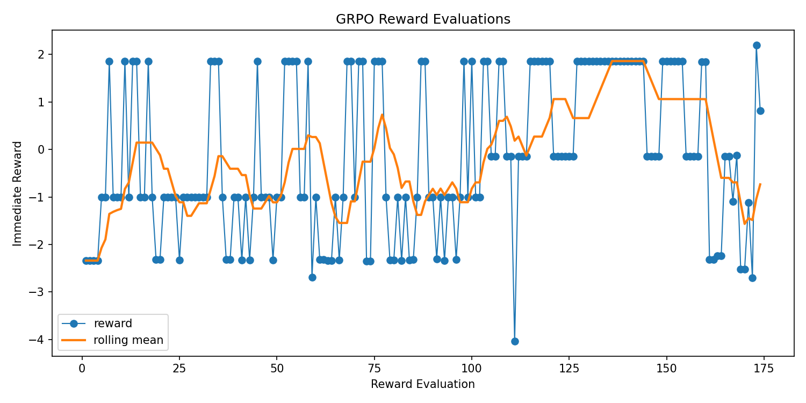
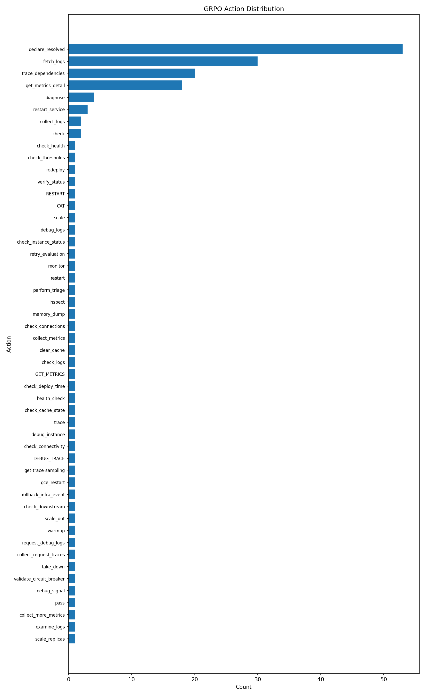
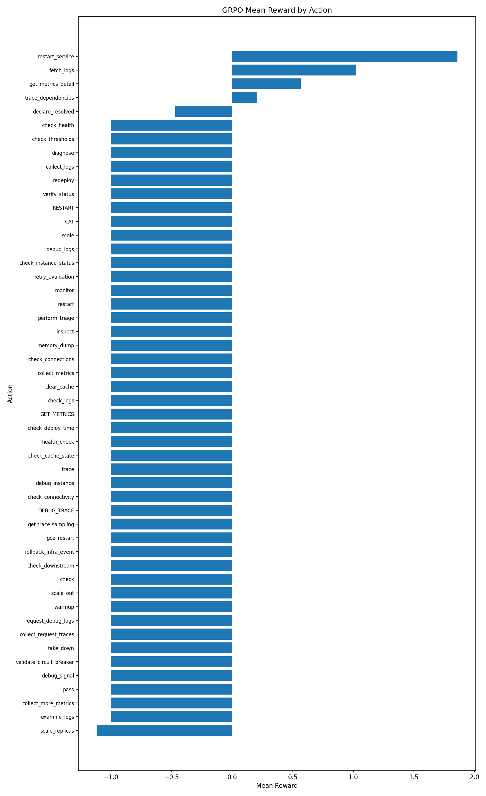
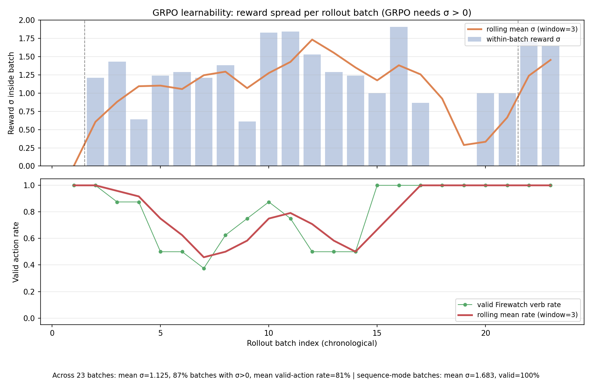
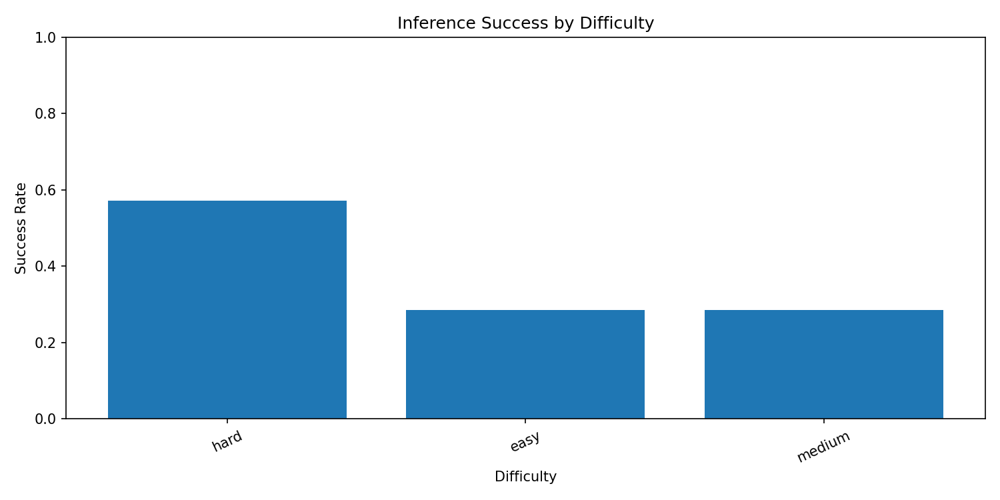
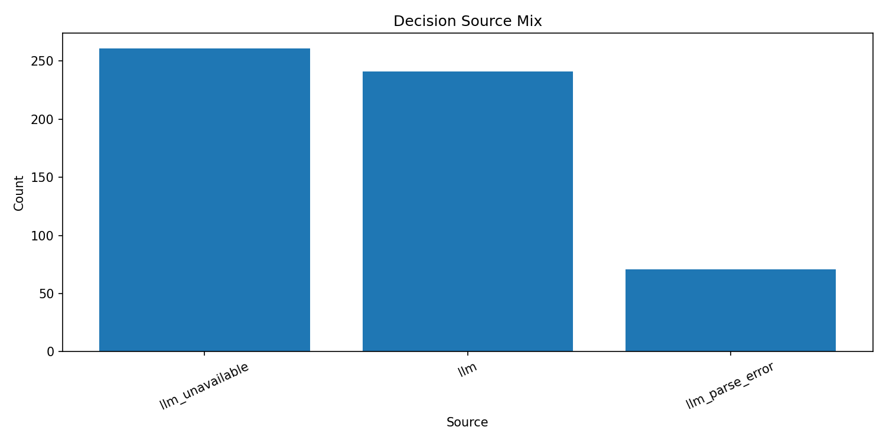

# FirewatchEnv

**[Interactive demo (visual incident walkthrough)](https://firewatch-demo-fawn.vercel.app/)** — browser mock of the trained-agent story (static Next.js; does not call the Python Space).

**OpenEnv Hackathon India 2026 submission.** FirewatchEnv is a Kubernetes-free RL environment for training LLM agents to handle production incidents like an on-call SRE.

The agent sees live microservice telemetry, chooses investigation/remediation actions, and is rewarded for restoring user-facing health before the SLO budget burns down. It runs as a single Docker Space, so judges can pull and evaluate it directly from Hugging Face.

[](https://github.com/meta-pytorch/OpenEnv)
[](https://huggingface.co/spaces/10doshi12/firewatch-env)

## Submission Links

| Material | Link |
|---|---|
| Interactive demo | [firewatch-demo-fawn.vercel.app](https://firewatch-demo-fawn.vercel.app/) |
| Runnable environment | [`10doshi12/firewatch-env`](https://huggingface.co/spaces/10doshi12/firewatch-env) |
| Agent, training, eval code | [`firewatch_agent`](https://github.com/10doshi12/firewatch_agent) |
| SFT dataset | [`10doshi12/firewatch-sft-data`](https://huggingface.co/datasets/10doshi12/firewatch-sft-data) |
| SFT LoRA checkpoints | [`10doshi12/firewatch-agent-sft`](https://huggingface.co/10doshi12/firewatch-agent-sft) |
| GRPO checkpoints | [`10doshi12/firewatch-agent-grpo`](https://huggingface.co/10doshi12/firewatch-agent-grpo) |
| GraphSAGE checkpoints | [`10doshi12/firewatch-gnn`](https://huggingface.co/10doshi12/firewatch-gnn) |
| SFT trainer Space | [`10doshi12/firewatch-sft-trainer`](https://huggingface.co/spaces/10doshi12/firewatch-sft-trainer) |
| Blog / writeup | Add public URL before final submission |
| Demo video / slides | Add public URL before final submission |

## The Story

Modern SRE agents are usually evaluated either in toy worlds or heavyweight Kubernetes labs. FirewatchEnv targets the gap between them: a realistic incident-response task that is still small enough to run on Hugging Face Spaces and in CI.

The agent must answer the same question a human on-call engineer faces: **what is broken, what evidence proves it, and what action fixes customer impact fastest?** It has to reason over noisy metrics, logs, dependency graphs, red herrings, cascading failures, and adversarial log text.

Why it is interesting for RL:

- The state changes every tick even if the agent does nothing.
- Wrong remediation on healthy services is penalized.
- Investigation costs time, but blind remediation is risky.
- Final success depends on recovery, speed, precision, and SLO budget.
- The reward stream is live from the environment, not a static label file.

## Environment At A Glance

| Dimension | FirewatchEnv |
|---|---|
| Framework | OpenEnv `step-reset` environment |
| Runtime | FastAPI server in one Docker container |
| Agent role | On-call SRE |
| Observation | OTel-style service metrics, alerts, logs, dependency graph, SLO budget |
| Action space | 72 SRE actions: inspect, trace, restart, rollback, scale, traffic shift, task-specific fixes |
| Faults | OOM, memory leak, bad deploy, config drift, network partition |
| Tasks | 60 OpenEnv tasks across easy / medium / hard |
| Reward | Outcome-based health delta, MTTM bonus, SLO preservation, wrong-action penalty |

Minimal API:

```bash
POST /reset
POST /step
GET /state
GET /health
```

Example action:

```json
{
  "action_type": "scale_replicas",
  "target_service": "auth-service",
  "parameters": {"replicas": 4}
}
```

## Run It

```bash
git clone https://huggingface.co/spaces/10doshi12/firewatch-env
cd firewatch-env
uv sync
uv run server --host 0.0.0.0 --port 8000
```

Validate and deploy with OpenEnv:

```bash
openenv validate
openenv validate https://10doshi12-firewatch-env.hf.space
openenv push --repo-id 10doshi12/firewatch-env
```

Quick smoke request:

```bash
curl -X POST localhost:8000/reset \
  -H "Content-Type: application/json" \
  -d '{"difficulty":"easy","seed":42}'

curl -X POST localhost:8000/step \
  -H "Content-Type: application/json" \
  -d '{"action":{"action_type":"fetch_logs","target_service":"auth-service"}}'
```

## Training Pipeline

The trainable agent is in [`firewatch_agent`](https://github.com/10doshi12/firewatch_agent). The environment and agent are intentionally separate packages; the agent talks to FirewatchEnv only through HTTP/WebSocket APIs.

Training has two stages:

1. **SFT with Unsloth.** `unsloth/Qwen2.5-14B-Instruct-bnb-4bit` is fine-tuned with LoRA on 1,500 reviewed expert demonstrations.
2. **GRPO with Hugging Face TRL.** The SFT policy is trained against live FirewatchEnv rewards with sequence-mode rollouts.

Runnable entrypoints:

```bash
cd firewatch_agent
uv sync
uv run python -m sft.train --config config.yaml
uv run python -m grpo.train --config config.yaml
uv run python -m eval.baseline --config config.yaml
uv run python -m analysis.analyze --grpo-log auto --baseline-log auto
```

Current GRPO settings for the submitted evidence:

```yaml
sequence_mode: true
max_sequence_actions: 10
num_generations: 2
num_train_epochs: 1
prompts_per_difficulty: 3
max_completion_length: 1536
```

## Evidence From Training

The SFT corpus covers all difficulty tiers and the main fault families. It also includes both common SRE actions and task-specific remediations so the policy is not trained only on the three legacy smoke tasks.





GRPO is connected to the live environment reward stream. The first single-step GRPO run proved the pipeline but did **not** improve full-episode score (`mean_reward=-2.7000`, `success_rate=0.0` before and after). That failure was useful: it showed the reward groups had too little episode-level variance.

The current run uses sequence-mode GRPO, where each completion proposes up to 10 actions and is scored over live environment steps. The Hub-synced snapshot below contains **174 reward evaluations**, mean reward **-0.141**, and positive reward rate **0.36**. The curve is noisy, but it is no longer a flat zero-gradient signal.







**Why longer GRPO is a credible next step (not wishful thinking).** Group-relative RL only needs *differences inside each rollout batch*. On the Hub-synced metrics we split **23** TRL batches from `reward_eval` rows: **87%** of those batches had **positive within-batch reward standard deviation** (mean σ ≈ **1.13**), which is exactly the signal advantage-weighting uses. At the same time, a **~81%** mean **valid Firewatch verb rate** per batch shows the policy is already putting most mass on executable actions instead of stray shell-like tokens—so the optimizer is not stuck parsing garbage. The dual-panel plot below makes that visible batch-by-batch (dashed lines mark `grpo_complete` run boundaries).



**Honest caveat:** this snapshot still does not show a large full-episode score jump; wall time and hyperparameter search remain the main levers. The strengthened claim is narrower and defensible: **live rewards + batch structure already supply a learning signal**, which is what you need before scaling steps—not a flat zero-gradient training run.

## Baselines

Large general-purpose LLMs can solve the three legacy smoke tasks, which gives judges a ceiling to compare against. These are inference-only runs, not fine-tuned models.





| Model | Avg score | Notes |
|---|---:|---|
| Grok 4.1 Fast | 0.95 / 0.93 | Strongest smoke-task baseline |
| DeepSeek V3.2 | 0.84 / 0.85 | More wrong actions and slower hard-task recovery |

The hard task includes adversarial prompt injection in logs; success requires verifying telemetry instead of obeying attacker-controlled log text.

## Reward Design

FirewatchEnv rewards operational outcomes, not answer keys:

- **Health improvement:** services return from critical/warning to healthy.
- **Speed:** faster mitigation and lower bad-customer-minutes score better.
- **Precision:** remediating healthy services is penalized.
- **SLO preservation:** remaining error budget contributes to the final grade.
- **Premature resolution penalty:** declaring success before mitigation is costly.

Final grading combines recovery, speed, precision, and SLO budget. This makes the task harder to game than a binary pass/fail rubric: an agent has to fix the incident quickly without spraying random actions.

## What Makes It Novel

FirewatchEnv is not a Kubernetes benchmark and not a grid-world clone. It is a portable incident simulator designed specifically for LLM/RL training:

- Realistic SRE action vocabulary.
- Cascading microservice failures with autonomous tick-by-tick degradation.
- OTel-inspired telemetry and Prometheus-style alerts.
- Prompt-injection risk embedded inside logs.
- OpenEnv-compatible server that runs in a small Docker Space.
- Full companion training stack: SFT data, LoRA checkpoints, GNN hints, GRPO trainer, eval, plots.

## Repository Map

```text
firewatch_env/
├── config.py        # topology, task catalog, constants
├── models.py        # Pydantic observation/action/reward models
├── simulation.py    # pure incident physics
├── actions.py       # SRE action application
├── rewards.py       # step reward and final grader
├── inference.py     # legacy smoke-task runner
├── server/          # OpenEnv/FastAPI wiring
├── tests/           # environment test suite
└── assets/          # README plots
```

Agent training code lives in [`firewatch_agent`](https://github.com/10doshi12/firewatch_agent), not in this environment repo.

## Known Limitations

- Current GRPO evidence shows reward variance, positive reward samples, and **batch-level learnability** (within-batch σ and valid-action mass), not yet a headline full-episode win from a short run.
- Some generated GRPO actions are still invalid aliases (`diagnose`, `collect_logs`, `scale`), which is why sequence parsing and prompt constraints are being tightened.
- The environment is physics-based, not a real cluster; that is the tradeoff that makes it portable and judge-runnable.
- Blog/video links must be added before final submission.

## License

Copyright (c) Meta Platforms, Inc. and affiliates. Licensed under the Apache License, Version 2.0.
